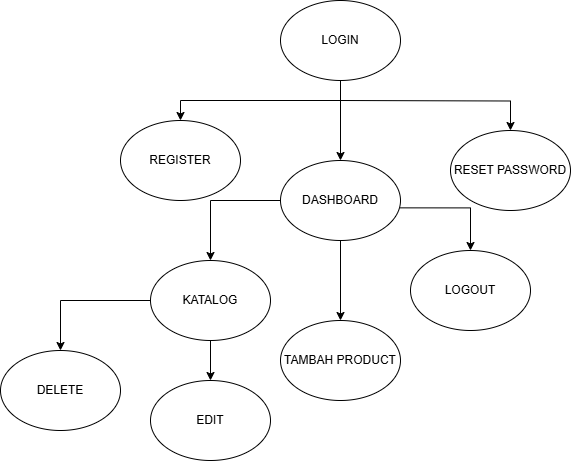

# Nama Aplikasi
Sistem Flask Katalog Baju

## Kegunaan Aplikasi
Aplikasi "Katalog Baju" ini adalah sebuah aplikasi web yang dirancang untuk membantu pengguna mencatat, mengelola, dan mengatur stok penjualanan baju mereka.

## Flowchart
Berikut adalah flowchart yang menggambarkan alur kerja aplikasi:

## Perkenalan Tim
- Wirdian Silvani (2213010381) - [Implementasi login, register, logout, dan reset password pada controllers.py, Membuat dan mengatur tampilan halaman untuk fitur-fitur yang ada]
- Natasha Zulatifa (2213010398) - [Implementasi fitur tambah, edit, hapus, dan daftar perjalanan, dan Implementasi model daftar untuk mengelola data stok penjualan,Membuat dan mengatur tampilan halaman untuk fitur-fitur yang ada]
- Schatzi Aurelia (2213010392) - [Menambahkan dan mengatur gaya CSS untuk tampilan halaman, Menampilkan statistik pada laman dashboard, Membuat dan mengatur tampilan halaman untuk fitur-fitur yang ada]

## Link Video Dokumentasi
Anda dapat menonton video dokumentasi aplikasi melalui tautan berikut: [Klik Disini](https://youtu.be/98APVvkTD8U)# 22g_flask_katalog_baju
